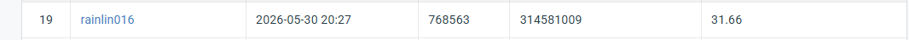
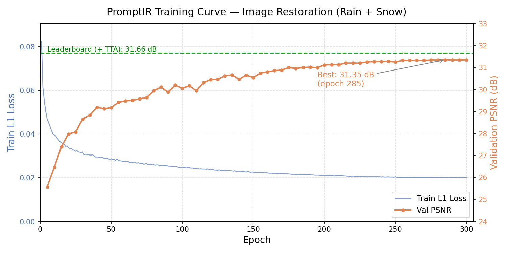

# HW4 — All-in-One Blind Image Restoration with PromptIR

## Introduction

This project implements **PromptIR** for all-in-one blind image restoration, targeting two degradation types: **rain streaks** and **snow artifacts**. A single model is trained from scratch to handle both degradation types without knowing which type is present at test time.

PromptIR uses a Restormer-based encoder-decoder backbone (MDTA + GDFN transformer blocks) with learned **Prompt Generation Blocks** at each encoder level. The prompts are dynamically weighted by global image statistics, allowing the model to implicitly detect the degradation type and guide restoration accordingly.

**Best result:** 31.66 dB PSNR on the public leaderboard (with 8-fold Test-Time Augmentation).

---

## Environment Setup

**Requirements:** Python 3.9+, CUDA-capable GPU

```bash
# Create and activate a virtual environment (recommended)
conda create -n promptir python=3.9 -y
conda activate promptir

# Install dependencies
pip install torch torchvision --index-url https://download.pytorch.org/whl/cu118
pip install Pillow tqdm numpy
```

**Expected dataset structure:**

```
data/hw4_realse_dataset/
├── train/
│   ├── degraded/    # rain-1.png ... rain-1600.png, snow-1.png ... snow-1600.png
│   └── clean/       # rain_clean-1.png ..., snow_clean-1.png ...
└── test/
    └── degraded/    # 0.png ... 99.png
```

---

## Usage

### Training

```bash
python train.py \
    --data_dir data/hw4_realse_dataset \
    --ckpt_dir checkpoints \
    --epochs 300 \
    --batch_size 4 \
    --patch_size 128 \
    --lr 3e-4
```

To resume from the latest checkpoint:

```bash
python train.py --resume
```

### Inference

Standard inference:

```bash
python test.py \
    --data_dir data/hw4_realse_dataset \
    --checkpoint checkpoints/best.pth \
    --output pred.npz
```

With 8-fold Test-Time Augmentation (D4 symmetries, recommended):

```bash
python test.py \
    --data_dir data/hw4_realse_dataset \
    --checkpoint checkpoints/best.pth \
    --output pred_tta.npz \
    --tta
```

The output `.npz` file stores restored images as a dictionary with keys `'0.png'` ... `'99.png'`, each with shape `(3, H, W)` in `uint8`.

---

## Performance Snapshot

Public leaderboard result (CodaBench):



| Method | Val PSNR | Leaderboard PSNR |
|---|---|---|
| PromptIR (300 epochs) | 31.35 dB | ~31.35 dB |
| PromptIR + 8-fold TTA | — | **31.66 dB** |


